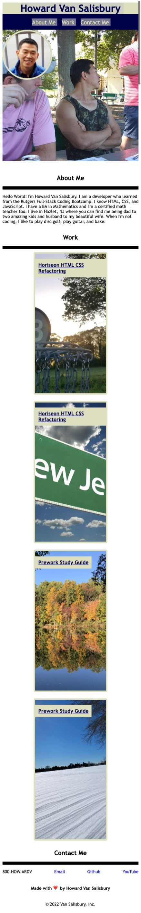

# Howard-Van-Salisbury-Portfolio

## Description

In order to show my coding abilities, I've created an online portfolio that contains past work. I wish to share my portfolio with perspective employers so that they can see what I am capable of. The page itself also showcases much of the HTML and CSS i've learned in bootcamp as well as using Github to deploy my sites.

## Table of Contents

 - [Online Portfolio](https://hvansalisbury.github.io/Howard-Van-Salisbury-Portfolio)
 - [Usage](#usage)
 - [Portfolio-Screenshots](#screenshots)

## Usage

This website was created to be responsive to adapt to the viewport of varoius devices. Open the site and adjust the browser size to see how the website changes to accomdate different screen sizes. Vist the site by clicking [here](https://hvansalisbury.github.io/Howard-Van-Salisbury-Portfolio).

## Credits

The following websites were used extensively while working on this project. However, this may not be a comprehensive list of every single resource utilized.

 - [Flexbox](https://developer.mozilla.org/en-US/docs/Web/CSS/CSS_Flexible_Box_Layout/Basic_Concepts_of_Flexbox)
 - [Responsive Design](https://developer.mozilla.org/en-US/docs/Learn/CSS/CSS_layout/Responsive_Design)
 - [Box Styling](https://developer.mozilla.org/en-US/docs/Learn/CSS/Howto/create_fancy_boxes)
 - [Flexbox Froggy](https://flexboxfroggy.com/)
 - [W3 Schools](https://www.w3schools.com/)

## Screenshot

## License

MIT License. See license for details.